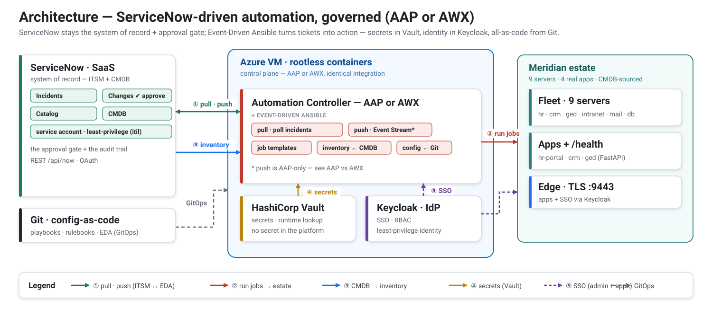

# ServiceNow → Ansible — governed IT automation

**Auto-remediation, self-service, and change execution driven from ServiceNow — without giving up control.**
*A governed integration (secrets in Vault, SSO, everything-as-code), on your choice of **AAP or AWX**.*

For a ServiceNow-driven organization that wants real Ansible automation **without bypassing governance**:
ServiceNow stays the **system of record** and the **approval gate**, while Event-Driven Ansible turns
tickets into action. A self-contained, end-to-end **blueprint** — running against a *realistic simulated
enterprise*, not throwaway hosts. Everything except ServiceNow (a real SaaS instance) runs as rootless
containers on a single VM.

> A monitored service crashes. Seconds later a ServiceNow incident appears, **Event-Driven Ansible**
> picks it up, restarts the service, and flips the ticket to **Resolved** — nobody touched a keyboard.
> Approve a *change* instead, and the same machinery executes it on the target and writes back a work note.

## What it automates — the point of the integration

- 🔁 **Auto-remediation (self-healing).** Service down → incident → EDA remediates → ticket **Resolved**,
  with a monitor that opens the incident on its own. No human in the loop.
- 🛒 **Self-service from ServiceNow.** Catalog requests (*Restart a service*, *Onboard an employee*) are
  fulfilled by Ansible, then the request closes itself.
- ✅ **ITSM-driven change execution.** An **approved** change is executed on the target and a **work note**
  is written back to the ticket.
- 🔧 **On-demand ops.** Diagnostics, disk cleanup, database admin, OS patching — triggered from a ticket.

## Governed by design

The automation never bypasses control — it runs *through* the organization's governance:

| Pillar | How it's enforced |
|---|---|
| **ITSM is the system of record & control point** | dynamic inventory from the **CMDB** (one source of truth); a change must be **approved** to run; every action traces to a ticket with a **work note** — a full audit trail |
| **Secrets** | **HashiCorp Vault** — resolved at job runtime, **no secret stored in the platform** |
| **Identity & least privilege** | **Keycloak SSO/RBAC**; scoped service accounts (`itil`-only, `manage-users`-only); no master admin in automation |
| **Everything-as-code / GitOps** | declarative EDA applied from Git — reproducible, reviewable by PR |
| **Contained blast radius** | EDA reacts only to the `Auto-Remediation` assignment group — not every incident |
| **Runtime sovereignty & cost** | **AAP** (supported) or **AWX** (open-source, no subscription) — a deliberate choice, at parity |

## The two integration patterns

| | **Pull** — incident remediation | **Push** — change execution |
|---|---|---|
| Trigger | service down → incident in `Auto-Remediation` | change request **approved** (with a CI) |
| Direction | **Controller → ServiceNow** (outbound poll) | **ServiceNow → Controller** (inbound webhook) |
| EDA source | `servicenow.itsm.records` (poll, 10 s) | `ansible.eda.webhook` via an **Event Stream** |
| Result | service restarted, incident **Resolved** | change deployed, **work note** written back |

Pull needs no inbound exposure and self-heals (it re-polls); push is near-real-time but needs ServiceNow
to reach an authenticated endpoint — and is **AAP-only** (AWX has no event-stream ingress; see
[05 · AAP vs AWX](docs/05-aap-vs-awx.md)). Both reuse the same content, targets, and configuration.

## One architecture, your choice of runtime

The control plane is a single box — an **Automation Controller (AAP *or* AWX)** plus Event-Driven
Ansible — fronted by ServiceNow and backed by **HashiCorp Vault** (secrets) and a **Keycloak** IdP, all
driving a *realistic simulated estate* (the *Meridian Group*: 6 support teams, 5 business services, 4 real
apps, 9 servers, a populated CMDB, business users). The runtime is a **choice, not a lock-in** — the
integration, the governance, and the automation content are identical on both, so you pick by support,
cost, and sovereignty. → **[05 · AAP vs AWX](docs/05-aap-vs-awx.md)**.

## Start here

New to it? Read in order — each page builds the mental model:

| # | Page | What you'll get |
|---|---|---|
| 1 | **[Overview](docs/01-overview.md)** | What this is and how the pieces fit — the 5-minute mental model |
| 2 | **[The simulator](docs/02-simulator.md)** | *Meridian Group*: who runs IT, what they run, how it's all one manifest |
| 3 | **[Architecture](docs/03-architecture.md)** | The control plane (AAP or AWX), the components, and what each script provisions |
| 4 | **[The patterns](docs/04-patterns.md)** | The runtime flows — pull, push, self-service, onboarding, self-healing |
| 5 | **[AAP vs AWX](docs/05-aap-vs-awx.md)** | The runtime comparison — parity, differences, and how to choose |
| 6 | **[Identity (SSO)](docs/06-identity.md)** | The Keycloak layer: app SSO + admin SSO |
| 7 | **[Playbooks](docs/07-playbooks.md)** | The automation content catalog (what each playbook does) |
| 8 | **[Build it](docs/08-build.md)** | The path — what you'll do, what you need, the manual steps |
| 9 | **[Step by step](docs/09-steps.md)** | The full build procedure — every command, with a verify check |
| 10 | **[Tests](docs/10-tests.md)** | The health dashboard + the functional scenarios |
| 11 | **[Notes](docs/11-notes.md)** | Hard-won lessons, limitations, and running cost |

## Status

**Working end-to-end** — auto-remediation, the self-healing monitor, the two catalog flows, change
execution, SSO, and Vault-backed secrets — each with a passing, re-runnable test, on **both AAP and AWX**.
It is a **proof of concept**: the governance *pattern* is demonstrated end-to-end, not production-hardened
(single node, self-signed certificates, dev-mode Vault/Keycloak). The honest limits are in
**[Notes](docs/11-notes.md)**.

## License

[MIT](LICENSE).
