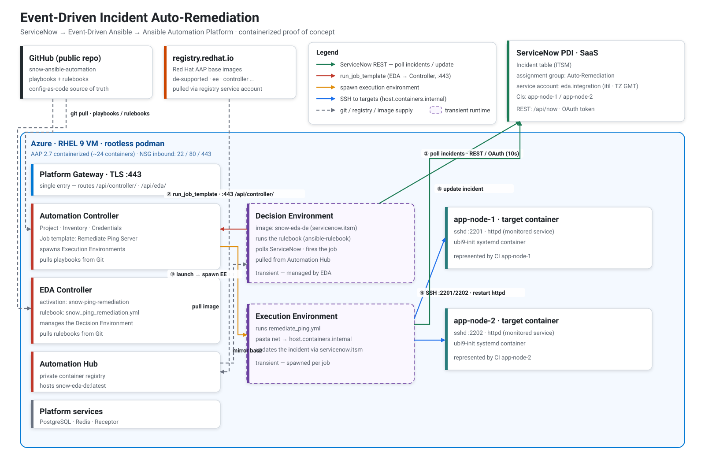

# ServiceNow + AAP + Event-Driven Ansible — Two Integration Patterns (PoC)

A self-contained proof of concept demonstrating **both directions** of a ServiceNow ↔ **Ansible
Automation Platform** integration, driven by **Event-Driven Ansible**:

- **Pull — incident auto-remediation.** EDA **polls** ServiceNow; a "service down" incident
  triggers a job that restarts the service and **resolves** the incident (or escalates).
- **Push — change execution.** ServiceNow **pushes** an *approved* Change Request to an EDA
  **Event Stream**; a job executes the change on the target and annotates the record.

Everything except ServiceNow runs as **rootless podman** containers on a single Azure RHEL 9 VM;
ServiceNow is a real SaaS Personal Developer Instance (PDI). The automation content is generic.

## The two patterns

| | **Pull** — incident remediation | **Push** — change execution |
|---|---|---|
| Trigger | service down → incident in `Auto-Remediation` group | change request **approved** (with a CI) |
| Direction | EDA → ServiceNow (**outbound** poll) | ServiceNow → EDA (**inbound** webhook) |
| EDA source | `servicenow.itsm.records` (poll, 10 s) | `ansible.eda.webhook` via an **Event Stream** |
| Job template | `Remediate Ping Server` | `Execute Change Request` |
| Playbook | `remediate_ping.yml` (restart + resolve) | `execute_change.yml` (deploy + work note) |
| Custom DE? | **yes** (`servicenow.itsm` is in no stock DE) | no — same DE; `ansible.eda` is built in |
| Exposure | outbound only | inbound on **:443** (gateway-managed, TLS) |
| End-to-end test | `tests/e2e_eda.py` | `tests/e2e_change.py` |

**Trade-off:** pull needs no inbound exposure and self-heals (it re-polls), at the cost of
latency; push is near-real-time but requires ServiceNow to reach an authenticated endpoint and
trust the gateway's certificate. Both reuse the same AAP install, targets, and DE.

## Architecture



Everything except ServiceNow runs as **rootless podman** containers on a single Azure RHEL 9 VM.
The numbered edges ①–⑤ on the architecture trace the **pull** runtime; the **push** pattern reuses
the same components and adds a gateway-managed **Event Stream**. The runtime flow of each pattern
(SVG, vector — sources + edge-colour legend in [`docs/`](docs/)):

| Pattern | Flow diagram |
|---|---|
| Pull — incident remediation | [`docs/remediation-flow.svg`](docs/remediation-flow.svg) |
| Push — change execution | [`docs/change-flow.svg`](docs/change-flow.svg) |

## How it works — objects & flow

### Pull — incident remediation

1. A monitored service goes down → an **incident** is opened in ServiceNow, assigned to the
   **Auto-Remediation** group (`state = New`).
2. **EDA** polls ServiceNow (`servicenow.itsm.records`), detects the incident, and triggers the
   `Remediate Ping Server` **job template**, passing the incident number + the affected host.
3. The job runs `remediate_ping.yml` in an execution environment: SSH to the target, restart the
   service, re-check.
4. The playbook updates the incident via `servicenow.itsm`: **Resolved** if the service is back,
   otherwise **escalated**.

### Push — change execution

1. A **Change Request** is **approved** in ServiceNow (and references a CI target).
2. A **Business Rule** POSTs the change (number, sys_id, target) to an AAP **Event Stream** — a
   gateway-managed webhook endpoint on `:443` with token auth.
3. The event stream feeds the `ansible.eda.webhook` source of the `snow-change-execution`
   activation, which triggers the `Execute Change Request` **job template**.
4. The job runs `execute_change.yml`: deploy the change to the target, restart the service, and
   write the result back to the change as a **work note**.

### Objects provisioned by the scripts

**ServiceNow** — `bootstrap/servicenow/setup.py` (pull) + `setup_change.py` (push)
| Object | Pattern | Role |
|---|---|---|
| Assignment group `Auto-Remediation` | pull | trigger filter — EDA only reacts to incidents here |
| Service account `eda.integration` (+ `itil`, TZ `GMT`) | pull | API identity for EDA + the playbook |
| CIs `app-node-1` / `app-node-2` | both | represent the target hosts |
| Business Rule *EDA - push approved change to AAP* | push | POSTs approved changes to the event stream |
| Trust-store cert (AAP gateway CA) | push | lets ServiceNow trust the gateway's TLS certificate |

**AAP controller** — `bootstrap/aap/controller/configure.py`
| Object | Role |
|---|---|
| Credential `Target SSH` (machine) | SSH key to reach the targets (user `ansible`) |
| Credential `ServiceNow PDI` (custom type) | injects `SN_HOST`/`SN_USERNAME`/`SN_PASSWORD` for `servicenow.itsm` |
| Inventory `POC Targets` | `app-node-1/2` at `host.containers.internal:2201/2202` |
| Project `snow-ansible-automation` | pulls the playbooks from this Git repo |
| Job template `Remediate Ping Server` (pull) / `Execute Change Request` (push) | run the two playbooks |

**EDA** — `bootstrap/aap/eda/configure.py` (pull) + `configure_push.py` (push)
| Object | Pattern | Role |
|---|---|---|
| Decision environment `snow-eda-de` | both | DE image (`de-minimal` + `servicenow.itsm`), pulled from the hub |
| Credential `AAP Controller` (host `…/api/controller/`) | both | lets the rulebooks launch job templates |
| EDA project `snow-ansible-automation` | both | rulebooks under `extensions/eda/rulebooks/` |
| Activation `snow-ping-remediation` | pull | polls ServiceNow → launches the job (injects `SN_*`) |
| `ServiceNow …Event Stream` credential + Event Stream | push | authenticated inbound endpoint on the gateway |
| Activation `snow-change-execution` | push | webhook source mapped to the event stream → launches the job |

> `configure.py` (controller) also removes the installer's `Demo *` objects; the `Ansible Galaxy`
> credential is a system default and is kept.

## Repository layout

**`bootstrap/`** holds everything you run once to *stand up and configure* the platform.
**`playbooks/`**, **`extensions/eda/rulebooks/`**, and **`collections/`** are the automation
content the AAP controller and EDA pull from this Git repo (the SCM project).

| Path | Purpose |
|---|---|
| `bootstrap/infra/` | Azure VM as **Bicep** (`main.bicep` + `resources.bicep` + `cloud-init.yaml`); copy `main.parameters.example.json` → `main.parameters.json` (gitignored) |
| `bootstrap/aap/` | AAP install (`install.sh` + inventory + `sync.sh`) **and** AAP config-as-code: `controller/configure.py`, `eda/configure.py` + `configure_push.py`, and the DE build (`eda/execution-environment.yml` + `build.sh`) |
| `bootstrap/awx/` | placeholder for a future AWX install (open-source alternative to AAP) |
| `bootstrap/servicenow/` | `setup.py` (pull objects) + `setup_change.py` (push: Business Rule + gateway-CA trust) |
| `bootstrap/targets/` | `Containerfile` + `deploy.sh` for the `app-node-1/2` target containers |
| `playbooks/` | `remediate_ping.yml` (pull) + `execute_change.yml` (push) — pulled by the controller project |
| `collections/` | `requirements.yml` — collections AAP installs at project sync (`servicenow.itsm`) |
| `extensions/eda/rulebooks/` | `snow_ping_remediation.yml` (pull, poll) + `snow_change_execution.yml` (push, webhook) |
| `tests/` | `healthcheck.py` + the three end-to-end tests (see below) — re-runnable validation |
| `docs/` | architecture + remediation-flow (pull) + change-flow (push) diagrams (SVG) |
| `.env.example` | template for `.env` — the single secrets file (copy and fill) |

### Tests (`tests/`)

All are idempotent and read `.env`. They build on each other from narrow to broad:

| Test | Scope | What it proves |
|---|---|---|
| `healthcheck.py` | infrastructure | ServiceNow auth, AAP gateway/controller, subscription, targets up, and the EE→target ad-hoc ping |
| `e2e_remediation.py` | controller only (**no EDA**) | breaks httpd, opens an incident, then **launches the job template directly** and checks the service is back + the incident resolved — isolates the playbook + ServiceNow write from the event layer |
| `e2e_eda.py` | full **pull** chain | opens an incident and asserts **EDA itself** auto-launches the job (never launched by the test) → resolved |
| `e2e_change.py` | full **push** chain | approves a change and asserts EDA auto-launches the execution job via the Event Stream → deployed + work note |

`e2e_remediation.py` is the deliberate "lower layer": if a full-chain test fails, it tells you
whether the break is in the playbook/ServiceNow side or in the event-driven trigger.

## Secrets

All env-style secrets live in a single **`.env`** at the repo root (gitignored, see
`.env.example`). It is **parsed by code, never `source`d** — values can contain shell-hostile
characters (`% ! > { } # & ; $` …). SSH keys stay as files.

| Secret | Location |
|---|---|
| ServiceNow (admin + `eda.integration`), registry, AAP admin, FQDN, `SN_EVENTSTREAM_TOKEN` | `.env` (repo root, gitignored) |
| Project SSH key (VM access) | `~/.ssh/snow-aap-poc` |
| Target SSH key | `bootstrap/targets/keys/` (gitignored) |
| AAP admin password (deployed copy) | also in `~/aap/inventory` on the VM (chmod 600) |

## Prerequisites

- Azure subscription + `az` CLI (`az login`).
- Red Hat account with an active AAP subscription — the free **60-day AAP trial** works.
- A ServiceNow **PDI**.
- A project SSH key: `ssh-keygen -t ed25519 -f ~/.ssh/snow-aap-poc -N ""`.
- Local tools: `az`, `ssh`, `rsync`, `python3`.

## Naming & consoles

Environment-specific values are **not committed** — they live in `.env` and
`bootstrap/infra/main.parameters.json` (both gitignored). Conventions:

- **FQDN** = `<dnsLabel>.<region>.cloudapp.azure.com` (set `FQDN` in `.env`).
- **AAP UI** = `https://<FQDN>/` — user `admin`, password in `~/aap/inventory` (self-signed cert).
- **ServiceNow PDI** = `https://<SN_INSTANCE>` (set `SN_INSTANCE` in `.env`).
- **Targets**: `app-node-1` (ssh host:2201), `app-node-2` (ssh host:2202).

Vendor consoles:

| What | URL |
|---|---|
| ServiceNow developer portal (create / wake a PDI) | https://developer.servicenow.com |
| Red Hat Hybrid Cloud Console (subscriptions, manifests) | https://console.redhat.com |
| Red Hat registry service accounts | https://access.redhat.com/terms-based-registry |
| Red Hat downloads (AAP setup tarball) | https://access.redhat.com/downloads |
| AAP free trial | https://www.redhat.com/en/technologies/management/ansible/trial |
| Azure portal | https://portal.azure.com |

---

## Step by step (what we did)

### 0. Accounts & artifacts

- Activate the Red Hat **AAP 60-day trial**.
- Create a Red Hat **registry service account** (access.redhat.com/terms-based-registry) →
  `username|token` to pull from `registry.redhat.io`.
- Download the **AAP 2.7 Containerized Setup** tarball (the small, non-bundle one) and drop it
  in `bootstrap/aap/` (gitignored).
- Provision a ServiceNow **PDI**.

### 1. Provision the VM (Bicep)

```bash
cd bootstrap/infra
cp main.parameters.example.json main.parameters.json   # fill: dnsLabel, location, sshPublicKey
az deployment sub create --name aap-poc --location <region> \
  --template-file main.bicep --parameters main.parameters.json
```

Brand-new subscription gotchas (do these first if needed):

```bash
az provider register -n Microsoft.Compute
az provider register -n Microsoft.Network
# Quota: Portal -> Subscription -> Usage + quotas -> "Standard DSv5 Family vCPUs"
#        in your region -> Request increase (e.g. 5).
```

- `cloud-init` installs podman/git/ansible-core at first boot and enables rootless linger.
- Connect:
  `az ssh vm -g rg-snow-aap-poc --vm-name aap-poc --local-user azureuser --private-key-file ~/.ssh/snow-aap-poc`

### 2. Install AAP 2.7 (containerized)

Fill `.env` (`REGISTRY_USERNAME`/`REGISTRY_PASSWORD`, `AAP_ADMIN_PASSWORD`, `FQDN`), drop the
setup tarball into `bootstrap/aap/`, then from your machine:

```bash
./bootstrap/aap/sync.sh                                   # pushes assets + .env to the VM
ssh -i ~/.ssh/snow-aap-poc azureuser@<FQDN> '~/aap/install.sh'
```

`install.sh` reads `.env` (registry login, admin password, FQDN), grows the LVM volumes (the
RHEL image LVs are tiny), adds the `FQDN -> private IP` `/etc/hosts` entry, renders the
single-node "growth" inventory, then runs `ansible.containerized_installer.install`. Result:
24 containers, all components on one node. **At first UI login, activate the subscription**
with your Red Hat username/password.

### 3. ServiceNow objects

```bash
cp .env.example .env        # fill in your values
python3 bootstrap/servicenow/setup.py
```

Creates the `Auto-Remediation` group, the `eda.integration` service account (+ `itil` role,
`active`, `password_needs_reset=false`), and the `app-node-1/2` CIs.

> **Gotcha**: ServiceNow silently ignores `user_password` writes via the Table API. Set
> `eda.integration`'s password **once in the UI** (open the user → *Set Password*) and store it
> in `.env` as `SN_EDA_PASSWORD` — otherwise basic auth returns 401.

### 4. Target containers

```bash
# one-time: generate the target SSH key (private gitignored; public = authorized_keys)
ssh-keygen -t ed25519 -f bootstrap/targets/keys/target_key -N "" -C poc-target
cp bootstrap/targets/keys/target_key.pub bootstrap/targets/authorized_keys

rsync -avz --exclude 'keys/' bootstrap/targets/ azureuser@<FQDN>:~/targets/
ssh -i ~/.ssh/snow-aap-poc azureuser@<FQDN> '~/targets/deploy.sh'
```

Builds an ubi9-init systemd container (sshd + httpd) and starts `app-node-1/2` with SSH on host
ports 2201/2202. Break the service with `podman exec app-node-1 systemctl stop httpd`.

### 5. Controller config-as-code

```bash
python3 bootstrap/aap/controller/configure.py   # credentials, inventory, project, job templates
python3 tests/healthcheck.py                     # 6 checks incl. EE -> target ad-hoc ping
```

### 6. Event-Driven Ansible

```bash
# build the custom DE and push it to the hub (run ON the VM; sync.sh already put it in ~/aap/eda/)
ssh -i ~/.ssh/snow-aap-poc azureuser@<FQDN> '~/aap/eda/build.sh'
# then, from your machine: DE, credentials, EDA project, rulebook activation
python3 bootstrap/aap/eda/configure.py
```

`configure.py` creates the decision environment, the hub registry + `AAP Controller` credentials,
the EDA project, and the rulebook activation (`log_level: info`). Two settings are load-bearing
(see Key findings): the controller credential host ends in **`/api/controller/`**, and
`eda.integration`'s ServiceNow timezone is **GMT**.

```bash
python3 tests/e2e_eda.py   # break httpd -> open incident -> EDA auto-launches the job -> resolved
```

### 7. Push pattern (Change Request → Event Stream)

```bash
python3 bootstrap/aap/eda/configure_push.py  # event stream (token) + webhook activation
python3 bootstrap/servicenow/setup_change.py # Business Rule + trust the gateway CA in ServiceNow
python3 tests/e2e_change.py                  # approve a change -> EDA executes it -> work note
```

`configure_push.py` reuses the same decision environment and `AAP Controller` credential, adds a
`ServiceNow Event Stream` credential (token = `SN_EVENTSTREAM_TOKEN`), creates the **Event Stream**
(a webhook endpoint on the gateway), and the `snow-change-execution` activation whose
`ansible.eda.webhook` source is **mapped to the stream** (`source_mappings`). `setup_change.py`
creates the Business Rule that POSTs approved changes to that endpoint, and uploads the gateway's
self-signed CA to ServiceNow's trust store so the outbound TLS validates (see Key findings).

---

## Key findings (lessons learned)

1. **EE → target networking** — the controller spawns execution environments with **pasta**
   networking, where `host.containers.internal` resolves to the host *and* can reach its
   rootless-published ports. So the targets (SSH published on the host at 2201/2202) are reached
   from the EE via **`host.containers.internal:2201/2202`** — the inventory sets
   `ansible_host=host.containers.internal` + `ansible_port` (not `127.0.0.1`, which is the EE's
   own loopback).
2. **Disk** — the RHEL LVM Azure image partitions only ~62 GB and ships tiny LVs (`/home` = 1 GB);
   the AAP images need ~25 GB → `install.sh` grows the partition + LVs.
3. **ServiceNow password** — not settable via the Table API; set it once in the UI and clear
   `password_needs_reset`.
4. **Azure quota/region** — a fresh subscription has 0 per-family vCPU quota and unregistered
   providers → register providers + request quota (the DSv5 grant may land in only one region).
5. **PAYG vs BYOS** — the RHEL PAYG image avoids Cloud Access/subscription-manager; the AAP trial
   only entitles image pulls (via the registry service account).
6. **EDA → controller API path** — `ansible-rulebook` chooses the controller API slug from the
   credential host: a host *with a path* (`https://<FQDN>/api/controller/`) selects the AAP 2.5+
   gateway slugs (`v2/config/`); a bare host selects the legacy `/api/v2/`, which **404s** behind
   the gateway. `run_job_template` silently never launches until the host carries the path.
7. **ServiceNow source timezone** — the `servicenow.itsm.records` source builds its poll-window
   filter with `gs.dateGenerate`, which ServiceNow evaluates in the **querying user's** timezone.
   The rulebook pins `remote_servicenow_timezone: UTC`, so `eda.integration`'s timezone must be
   **GMT** (`setup.py` sets it) — otherwise the window shifts hours ahead and new incidents are
   never matched. A far-past `updated_since` masks this in quick tests; it only bites at "now".
8. **EDA DE image must be in a registry** — activation workers pull the DE by `image_url` from a
   registry credential; a `localhost/...` image is invisible to them, so `build.sh` pushes the DE
   to the private hub and the DE points at `<FQDN>/snow-eda-de:latest` (pull policy `always`).
9. **Custom DE only for what's missing** — Red Hat's recommended base is `de-minimal` (it already
   ships `ansible.eda`); we add only `servicenow.itsm`. The *push* pattern's webhook source is in
   `ansible.eda`, so it needs **no** custom content — the same DE serves both.
10. **Push uses Event Streams, not an open port** — the inbound webhook is a gateway-managed
   endpoint on `:443` with a credential (here a `ServiceNow Event Stream` token). The activation's
   rulebook keeps an `ansible.eda.webhook` source that is **mapped** to the stream via
   `source_mappings` (source name + `rulebook_hash`). Nothing extra is opened in the NSG.
11. **ServiceNow → gateway TLS** — ServiceNow validates outbound TLS, so the Business Rule's POST
   fails with `HTTP 0` against the gateway's self-signed cert. Fix: upload the AAP gateway CA
   (`~/aap/tls/ca.cert`, CN *Ansible Automation Platform*) into ServiceNow's trust store as a
   `trust_store` certificate (ServiceNow rewrites `short_description` to the cert CN on save).
   Production alternative: a CA-signed cert on the gateway.
12. **ServiceNow change state model** — the Table API rejects arbitrary `state` jumps (a guard
   business rule), so the trigger keys off the writable `approval` field (`approved`), and the
   playbook records a **work note** instead of transitioning the change.

## Status

**Done — both integration patterns working end-to-end**, each with a passing re-runnable test:

- **Pull** (`tests/e2e_eda.py`): a ServiceNow incident in `Auto-Remediation` is auto-detected by
  the polling activation, which launches the job; the playbook restarts the service and resolves
  the incident — no manual launch.
- **Push** (`tests/e2e_change.py`): an approved Change Request is pushed via the Event Stream to
  the webhook activation, which launches the job; the playbook deploys the change and writes a work
  note back — no manual launch.

Covered: infra, host base, AAP 2.7 install, targets, EE→target path, controller + EDA
config-as-code, custom DE, both activations, and the ServiceNow side of both patterns.

**Optional next steps**: AWX variant (`bootstrap/awx/`), more playbooks/use cases, a CA-signed
gateway cert, and a subscription manifest for offline entitlement.

## Lifecycle & cost

```bash
az vm deallocate -g rg-snow-aap-poc -n aap-poc   # stop compute billing
az vm start      -g rg-snow-aap-poc -n aap-poc   # restart
az group delete  -n rg-snow-aap-poc --yes        # tear everything down
```

- The target containers are **not** persistent across reboots — re-run `~/targets/deploy.sh`
  after a VM restart.
- D4s_v5 ≈ 5-6 €/day while allocated; the 128 GB Premium disk keeps billing when deallocated.

## License

[MIT](LICENSE).
