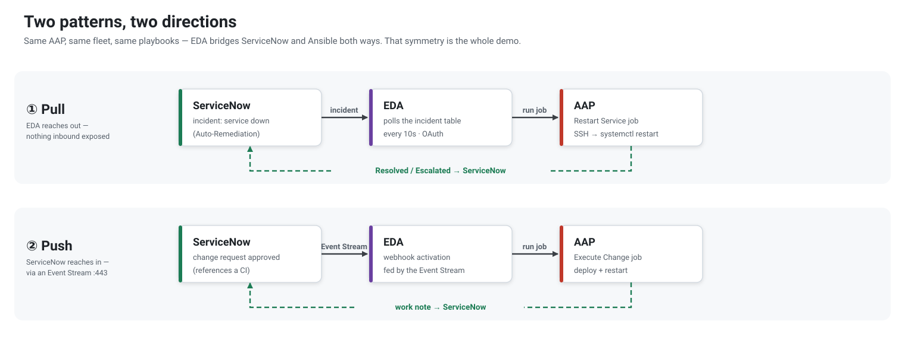

[↑ Docs map](../README.md#start-here) · **01 · Overview** · [02 · The simulator →](02-simulator.md)

# Overview — the mental model

Five minutes to grasp what this is, before any code. The whole PoC is **three actors and two
patterns**.

## Three actors

| Actor | Role | Think of it as |
|---|---|---|
| **ServiceNow** | the system of record (ITSM) — incidents, changes, the CMDB, the service catalog | *where work is requested and tracked* |
| **Ansible Automation Platform (AAP)** | the automation engine — job templates run playbooks against the fleet | *the hands that do the work* |
| **Event-Driven Ansible (EDA)** | the connective tissue — it watches for events and launches the right job | *the reflex between the two* |

EDA is what makes this **event-driven** rather than scheduled or manual: nothing runs on a timer and
no one clicks "launch". An event happens, the right automation fires.

## Two patterns — the two ways EDA bridges the gap

- **Pull** — EDA *polls* ServiceNow's incident table (every 10 s). A matching incident launches the
  remediation job. ServiceNow doesn't even need to know AAP exists; nothing inbound is exposed; it
  self-heals because it keeps re-polling.
- **Push** — a ServiceNow **Business Rule** POSTs an approved change to an AAP **Event Stream** (a
  gateway-managed webhook). The event launches the execution job. Near-real-time, at the cost of one
  authenticated inbound endpoint.

Same AAP install, same fleet, same content — two opposite trigger directions. That symmetry *is* the
demo. The step-by-step runtime of each lives in **[04 · The patterns](04-patterns.md)**.

## Running against something real

The automation doesn't act on throwaway hosts — it acts on **Meridian Group**, a fictional but
coherent enterprise: support teams, business services, applications, servers, a populated CMDB,
business users, and an identity provider. One manifest (`simulator/fleet.yml`) defines it all and
materialises it everywhere (containers, the ServiceNow CMDB, Keycloak, the AAP inventory) — so a
ServiceNow incident maps cleanly to a real server, its owning team, and the right playbook.

Meet the cast in **[02 · The simulator](02-simulator.md)**.

## What this is *not*

A production deployment. It's a deliberately-scoped PoC: a single node, self-signed certificates,
throwaway target containers, and a free ServiceNow developer instance. The honest limits — and the
hard-won lessons behind the parts that were tricky — are in **[10 · Notes](10-notes.md)**.

---
[↑ Docs map](../README.md#start-here) · **01 · Overview** · [02 · The simulator →](02-simulator.md)
