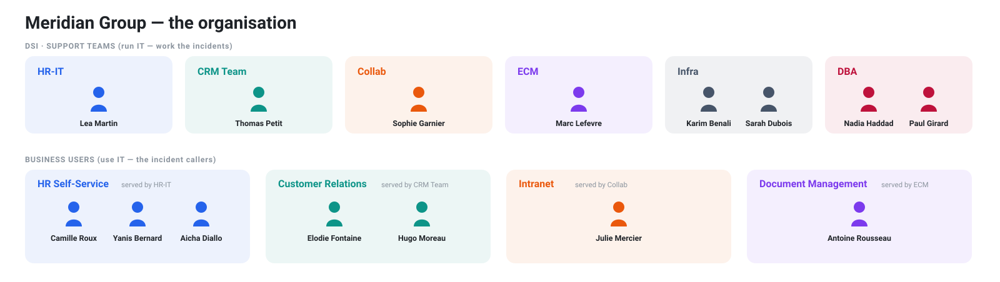
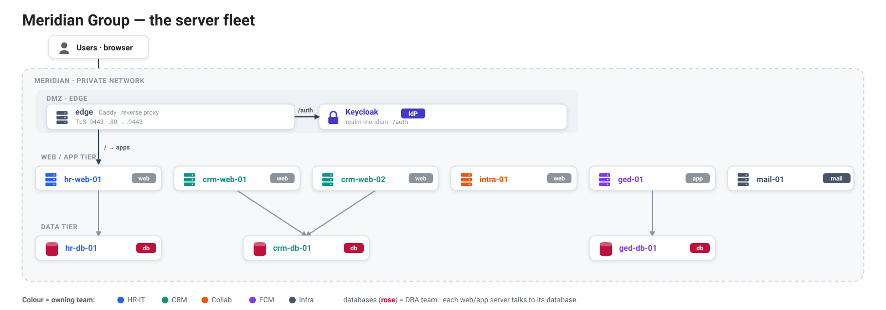
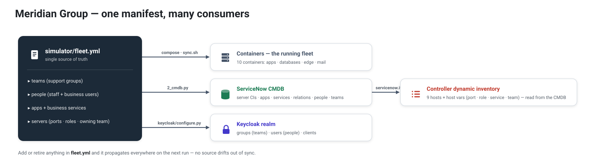

[↑ Docs map](../README.md#start-here) · [← 01 · Overview](01-overview.md) · **02 · The simulator** · [03 · Architecture →](03-architecture.md)

# The simulator — Meridian Group

A fictional company whose IT estate this PoC simulates, so the ServiceNow ↔ Ansible automation runs
against something coherent and believable instead of throwaway hosts.

## Who → what → how

**Meridian Group** is a mid-size enterprise (~2,000 employees, several sites). Its IT department (the
*DSI*) runs a handful of internal business applications, each owned by a support team — exactly what
ServiceNow models: **business service → application → servers → assignment group**.

**Who** — the DSI support teams that run IT, and the business users that consume it (colour = domain;
a team and the service its users consume share it):

| Business service | Application | Servers | Support team |
|---|---|---|---|
| HR Self-Service | HR Portal (FastAPI) | `hr-web-01`, `hr-db-01` | HR-IT, DBA |
| Customer Relations | CRM (FastAPI) | `crm-web-01`, `crm-web-02`, `crm-db-01` | CRM Team, DBA |
| Intranet | Intranet (static) | `intra-01` | Collab |
| Document Management | GED (FastAPI) | `ged-01`, `ged-db-01` | ECM, DBA |
| Mail | Mail Relay (postfix) | `mail-01` | Infra |

**What** — the infrastructure those servers form: a DMZ edge (Caddy + Keycloak) in front of a
web/app tier that talks to a data tier:

**How** — [`simulator/fleet.yml`](../simulator/fleet.yml) describes the whole estate once and
materialises into every downstream system, so nothing drifts out of sync:

The end-to-end chain is then coherent:
`incident.cmdb_ci → server → role/service (host var) → remediation playbook → right team`.

## Real apps

The applications under [`simulator/apps/`](../simulator/apps/) are **real, runnable services**
(FastAPI + HTML), each with a `/health` endpoint. That lets Event-Driven Ansible detect genuine
outages with the `ansible.eda.url_check` source (not hand-created incidents), and lets the playbooks
restart real services and verify real health.

Faults can be injected for the demo (stop the systemd service, or drop the health flag file) — the
automation then detects, remediates, and verifies.

## Access — the edge gateway (DMZ)

A Caddy reverse proxy ([`simulator/apps/edge/Caddyfile`](../simulator/apps/edge/Caddyfile)) is the
single internet-facing entry — the DMZ in front of the apps (see the infrastructure diagram above). It
terminates TLS on **`:9443`** (`:80` redirects up; the NSG opens 9443), and the apps' `908x` ports
stay host-only (used internally by EDA `url_check`). It path-routes the one FQDN:

| URL | Goes to |
|---|---|
| `https://<FQDN>:9443/` | Intranet portal (services directory) |
| `https://<FQDN>:9443/hr/` | HR Portal |
| `https://<FQDN>:9443/crm/` | CRM (load-balanced over `crm-web-01` / `crm-web-02`) |
| `https://<FQDN>:9443/ged/` | GED |
| `https://<FQDN>:9443/auth/` | Keycloak (the IdP) |

The control plane keeps `:443` (the AAP gateway, or AWX's Traefik); the Meridian edge sits on `:9443` so the two never collide.

## Identity (Keycloak)

**Keycloak** is part of the stack — Meridian's IdP behind the edge on `:9443/auth`, built from the
same `fleet.yml` (groups = teams, users = people). Application users sign in via OIDC; controller
admins (AAP or AWX) federate to it for SSO. Full detail in **[06 · Identity (SSO)](06-identity.md)**.

> Everything here is fictional. `*.meridian.example` is a documentation domain; no real company,
> data, or credentials are involved.

---
[↑ Docs map](../README.md#start-here) · [← 01 · Overview](01-overview.md) · **02 · The simulator** · [03 · Architecture →](03-architecture.md)
