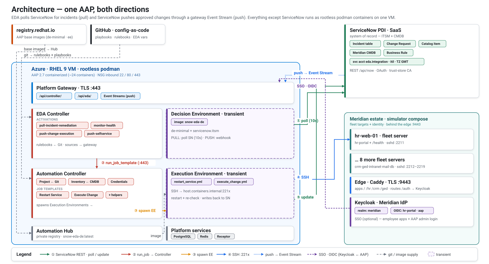

[↑ Docs map](../README.md#start-here) · [← 02 · The simulator](02-simulator.md) · **03 · Architecture** · [04 · The patterns →](04-patterns.md)

# Architecture — the control plane

Everything except ServiceNow runs as **rootless podman** containers on a single Azure RHEL 9 VM. The
numbered edges **①–⑤** trace the **pull** runtime; the dashed **blue** edge is the **push** Event
Stream (ServiceNow → gateway), and the dashed **purple** edge is the optional **Keycloak SSO** (OIDC).
On the right, the Meridian estate — the SSH target fleet, the edge gateway on `:9443`, and Keycloak —
runs in its own `simulator/` compose stack (see [02 · The simulator](02-simulator.md)). Each AAP
component lists its concrete objects as chips (activations, job templates, credentials, …).

The step-by-step **runtime** of each pattern — with the `remediation-flow.svg` / `change-flow.svg`
diagrams — is in **[04 · The patterns](04-patterns.md)**.

## Objects provisioned by the scripts

**ServiceNow** — `bootstrap/4_servicenow/1_account.py` (pull) + `3_push_change.py` (push)

| Object | Pattern | Role |
|---|---|---|
| Assignment group `Auto-Remediation` | pull | trigger filter — EDA only reacts to incidents here |
| Service account `eda.integration` (+ `itil`, TZ `GMT`) | pull | API identity for EDA + the playbook |
| Meridian CMDB (servers, apps, business services, relations, people) | both | loaded from `simulator/fleet.yml` by `bootstrap/4_servicenow/2_cmdb.py` |
| Business Rule *EDA - push approved change to AAP* | push | POSTs approved changes to the event stream |
| Trust-store cert (AAP gateway CA) | push | lets ServiceNow trust the gateway's TLS certificate |

**AAP controller** — `bootstrap/5A_aap/controller/configure.py`

| Object | Role |
|---|---|
| Credential `Target SSH` (machine) | SSH key to reach the targets (user `ansible`) |
| Credential `ServiceNow PDI` (custom type) | injects `SN_HOST`/`SN_USERNAME`/`SN_PASSWORD` for `servicenow.itsm` |
| Inventory `Meridian Fleet` + source `ServiceNow CMDB` | **dynamic inventory** from the ServiceNow CMDB (`inventory.now.yml`, `servicenow.itsm.now`): server CIs become hosts, the `u_*` columns + standard `support_group` become host vars (`ansible_port`/`service`/`role`/`support_group`), `keyed_groups` build `role_*` / `team_*` groups |
| Project `snow-ansible-automation` | pulls the playbooks from this Git repo |
| Job template `Restart Service` (pull) / `Execute Change Request` (push) | run the two core playbooks |
| Job templates `Collect Diagnostics` · `Free Disk` · `Open Incident` · `DB Create Role` · `DB Apply Migration` · `DB Status` · `DB Backup` | the helper / DB-admin playbooks (see [06 · Playbooks](06-playbooks.md)) |

**EDA** — base (DE, credentials, project) via `eda/configure.py`; the **event streams + all 5
activations are declarative** — `eda/vars/eda.yml` applied by the **Configure EDA** job template
(`eda/configure.yml`, `infra.aap_configuration` — GitOps: AAP configures itself from this repo).

| Object | Pattern | Role |
|---|---|---|
| Decision environment `snow-eda-de` | all | DE image (`de-minimal` + `servicenow.itsm`), pulled from the hub |
| Credential `AAP Controller` (host `…/api/controller/`) | all | lets the rulebooks launch job templates |
| EDA project `snow-ansible-automation` | all | rulebooks under `extensions/eda/rulebooks/` |
| Activation `pull-incident-remediation` | pull | polls ServiceNow → launches the job (injects `SN_*`) |
| Activation `monitor-health` | monitor | `ansible.eda.url_check` on each `/health` → `Open Incident` (self-driving pull) |
| `ServiceNow …Event Stream` credential + Event Streams (`…-chg-stream`, `…-catalog-stream`) | push | authenticated inbound endpoints on the gateway |
| Activation `push-change-execution` | push | webhook source mapped to the change stream → launches the job |
| Activation `push-selfservice-restart` | push | webhook source mapped to the catalog stream → launches the job |

> `configure.py` (controller) also removes the installer's `Demo *` objects; the `Ansible Galaxy`
> credential is a system default and is kept.

## Repository layout

**`bootstrap/`** holds everything you run once to *stand up and configure* the platform.
**`playbooks/`**, **`extensions/eda/rulebooks/`**, and **`collections/`** are the automation content
the AAP controller and EDA pull from this Git repo (the SCM project).

| Path | Purpose |
|---|---|
| `bootstrap/1_infra/` | Azure VM as **Bicep** (`main.bicep` + `resources.bicep` + `cloud-init.yaml`); copy `main.parameters.example.json` → `main.parameters.json` (gitignored) |
| `bootstrap/2_fleet/` | **deploys** the target fleet — `sync.sh` (laptop) + `deploy.sh` (VM) + the `Target SSH` key; the fleet *definition* lives in `simulator/` |
| `bootstrap/3_keycloak/` | the Meridian IdP as code (`configure.py`) — see [05 · Identity](05-identity.md) |
| `bootstrap/4_servicenow/` | numbered by run order: `1_account.py`, `2_cmdb.py`, `3_push_change.py`, `4_catalog.py` |
| `bootstrap/5A_aap/` | AAP install (`install.sh` + inventory + `sync.sh`) **and** AAP config-as-code: `controller/configure.py` + `eda/configure.py` (base, Python), the **declarative** EDA config (`eda/configure.yml` + `eda/vars/eda.yml`), and the DE build (`eda/execution-environment.yml` + `build.sh`) |
| `bootstrap/5B_awx/` | the AWX variant (open-source alternative to `5A_aap`) — placeholder for a future install |
| `simulator/` | **the simulated estate** (definition) — `fleet.yml` (source of truth), real apps (`apps/`), DB/mail images (`base/`), edge gateway + Keycloak, `compose.yml` — see [02 · The simulator](02-simulator.md) (deployed by `bootstrap/2_fleet/`) |
| `playbooks/` | the automation content (`restart_service.yml`, `execute_change.yml`, …) — see [06 · Playbooks](06-playbooks.md) |
| `collections/` | `requirements.yml` — collections AAP installs at project sync (`servicenow.itsm`, `ansible.eda`, `infra.aap_configuration`) |
| `extensions/eda/rulebooks/` | the EDA rulebooks (pull poll + push webhooks) |
| `lib/` | shared stdlib modules, layered: `poc.py` (transport), `servicenow.py` (the `Snow` client + Business-Rule builder), `aap.py` (controller/EDA client with job polling), `runtime.py` (AAP/AWX runtime seam) |
| `tests/` | `health.py` (read-only dashboard) + `scenarios/` (functional tests) — see [09 · Tests](09-tests.md) |
| `docs/` | this documentation set + the SVG diagrams |
| `.env.example` | template for `.env` — the single secrets file (copy and fill) |

---
[↑ Docs map](../README.md#start-here) · [← 02 · The simulator](02-simulator.md) · **03 · Architecture** · [04 · The patterns →](04-patterns.md)
