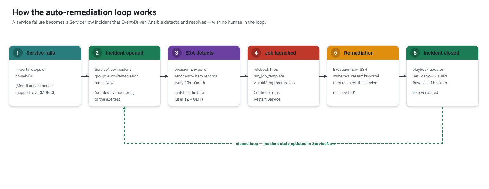
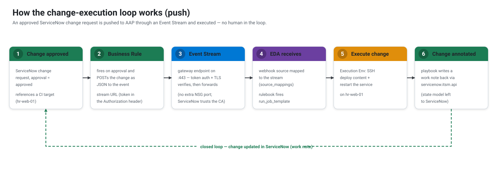

[↑ Docs map](../README.md#start-here) · [← 03 · Architecture](03-architecture.md) · **04 · The patterns** · [05 · AAP vs AWX →](05-aap-vs-awx.md)

# The patterns — runtime flows

The two core patterns (pull and push), plus the catalog variants built on pull. The conceptual model is
in [01 · Overview](01-overview.md); this page walks the **runtime**, step by step.

## Pull — incident remediation

1. A monitored service goes down → an **incident** is opened in ServiceNow, assigned to the
   **Auto-Remediation** group (`state = New`). This can be opened by anyone, or **self-driven** (see
   the monitor loop below).
2. **EDA** polls ServiceNow (`servicenow.itsm.records`), detects the incident, and triggers the
   `Restart Service` **job template**, passing the incident number + the affected host.
3. The job runs `restart_service.yml` in an execution environment: SSH to the target, restart the
   service, re-check.
4. The playbook updates the incident via `servicenow.itsm`: **Resolved** if the service is back,
   otherwise **escalated**.

**Self-driving** — the `monitor-health` activation probes each app's `/health` with
`ansible.eda.url_check` and raises the incident itself (via the `Open Incident` job template →
[`open_incident.yml`](../playbooks/open_incident.yml)). So no human even opens the ticket: outage →
incident → remediation → resolved.

## Push — change execution

> **AAP-only.** Push needs the gateway's managed Event Stream; AWX/eda-server has no event-stream
> ingress, so on AWX every flow is pull (see [05 · AAP vs AWX](05-aap-vs-awx.md)).

1. A **Change Request** is **approved** in ServiceNow (and references a CI target).
2. A **Business Rule** POSTs the change (number, sys_id, target) to an AAP **Event Stream** — a
   gateway-managed webhook endpoint on `:443` with token auth.
3. The event stream feeds the `ansible.eda.webhook` source of the `push-change-execution` activation,
   which triggers the `Execute Change Request` **job template**.
4. The job runs `execute_change.yml`: deploy the change to the target, restart the service, and write
   the result back to the change as a **work note**.

## Pull — self-service catalog

1. A user orders the **Service Catalog** item "Restart a service" and picks a server.
2. The `servicenow.itsm.records` source of the `pull-selfservice-restart` activation polls `sc_req_item`
   for new (Open) requests of that item — **no Business Rule, no event stream**.
3. It triggers the `Restart Service (Self-Service)` **job template**; the job's playbook fetches the
   chosen server from the request's catalog variables (by `request_sysid`).
4. `restart_service_selfservice.yml` restarts that server's service and **closes the request item**.

## Pull — employee onboarding

The same catalog mechanism, but the request creates an **identity** instead of restarting a service:
ordering "Onboard a new employee" is polled by the `pull-onboarding` activation, which runs the
`Provision Employee` job template → [`provision_employee.yml`](../playbooks/provision_employee.yml)
fetches the form's variables, creates the Keycloak user (in the *Employees* group) and closes the
request. See [06 · Identity](06-identity.md).

---

All five activations are created declaratively (the **Configure EDA** job template); the catalog
items are set up by `bootstrap/5_servicenow/3_catalog.py` and the change Business Rule by
`4_push_change_aap.py`. Each flow has a
re-runnable scenario test — see [10 · Tests](10-tests.md).

---
[↑ Docs map](../README.md#start-here) · [← 03 · Architecture](03-architecture.md) · **04 · The patterns** · [05 · AAP vs AWX →](05-aap-vs-awx.md)
