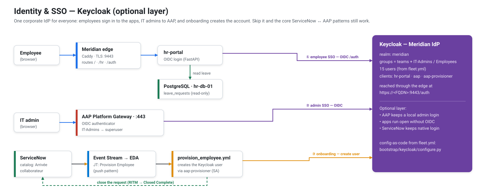
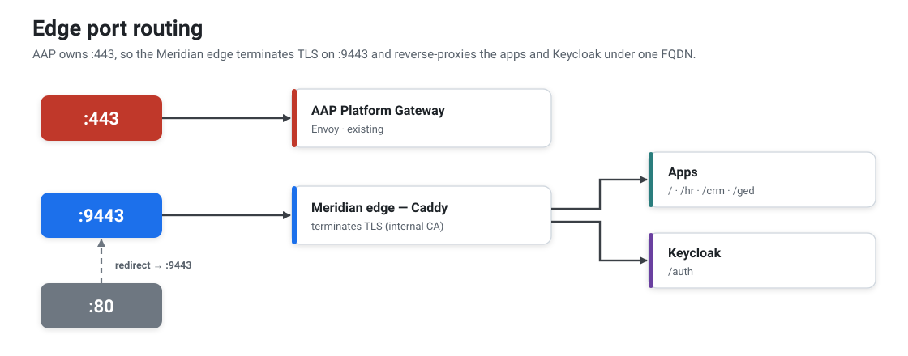
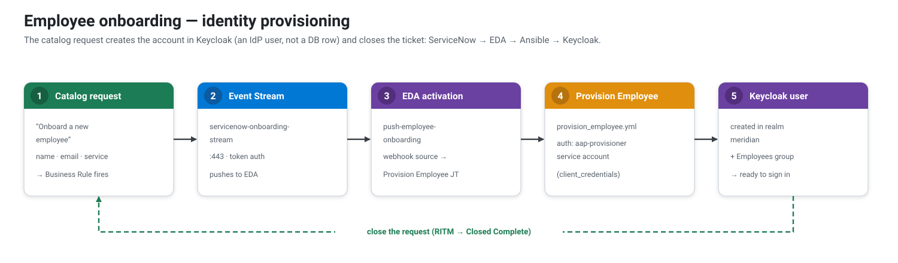
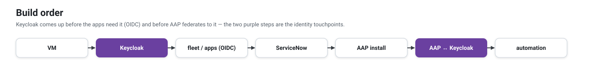

<sub>[↑ Docs map](../README.md#start-here) · [← 04 · The patterns](04-patterns.md) · **05 · Identity (SSO)** · [06 · Playbooks →](06-playbooks.md)</sub>

# Identity & SSO — Keycloak

Keycloak is part of the **simulated IT estate** (it ships in `simulator/compose.yml`, not the AAP
control plane) — it's Meridian's single sign-on. Employees authenticate to the apps through it, and
the AAP admins federate to it. It's the same identity for everyone.



> **Optional layer.** SSO is a realism add-on — the core PoC (the two ServiceNow ↔ AAP patterns) works
> fully without it. AAP keeps its **local `admin`** login, and the apps run **open** when the `OIDC_*`
> env is absent. Skip the whole Keycloak phase and nothing else breaks. **Scope:** SSO covers the apps
> and AAP only — **ServiceNow keeps its native login** (federating a SaaS PDI to a Keycloak on a
> private VM is out of scope; see [10 · Notes](10-notes.md)).

## Topology



`:443` is taken by AAP, so the Meridian edge terminates TLS on **`:9443`** and reverse-proxies both
the apps and Keycloak under the FQDN. Keycloak runs with `KC_HTTP_RELATIVE_PATH=/auth` and trusts the
edge's `X-Forwarded-*` headers. Dev mode (H2, ephemeral) for the PoC — re-run `configure.py` after a
Keycloak restart.

## `configure.py` — realm as code (from `fleet.yml`)

Idempotent, stdlib-only, admin REST API. The same `simulator/fleet.yml` that feeds the ServiceNow CMDB
builds the `meridian` realm:

- **groups** — one per support team (= the ServiceNow assignment groups), plus `IT-Admins` (umbrella
  for DSI staff) and `Employees`;
- **users** — every person in `fleet.yml` (username = email local part), shared demo password from
  `.env` (`KC_DEMO_PASSWORD`); staff land in their team + `IT-Admins`, business users in `Employees`;
- **clients** — `hr-portal` (employee SSO) and `aap` (admin SSO via the AAP gateway, with a `groups`
  token mapper). Client secrets come from `.env` so Keycloak and the apps share them.

```bash
./bootstrap/2_fleet/sync.sh                  # bring the stack up (incl. Keycloak) on the VM
python3 bootstrap/3_keycloak/configure.py    # then build the realm
```

- Admin console: `https://<FQDN>:9443/auth/admin/` (master realm, user `admin`).
- Account portal: `https://<FQDN>:9443/auth/realms/meridian/account` (any user, demo password).

## App SSO — hr-portal

`hr-portal` (FastAPI) uses the `hr-portal` OIDC client (Authorization Code flow): the UI and the
directory API require a Keycloak login; **`/health` stays public** so the EDA `url_check` monitor keeps
working. With no `OIDC_*` env, the app runs open (auth disabled).

Two non-obvious points the wiring handles:
- **Consistent issuer.** The browser *and* the app's back-channel both use the external issuer
  `https://<FQDN>:9443/auth/realms/meridian`. The edge has a compose **network alias for `${FQDN}`**, so
  the app reaches Keycloak through the edge (same issuer) without NAT hairpinning.
- **systemd env.** The app runs as a systemd unit (which doesn't inherit container env by default) —
  `hr-portal.service` lists the `OIDC_*` vars under `PassEnvironment`, set by compose on `hr-web-01`.

Smoke-test it: `python3 tests/health.py --only sso`.

## AAP admin SSO

`bootstrap/6A_aap/configure_sso.py` federates the **AAP Platform Gateway** to Keycloak (idempotent):

- an **OIDC authenticator** pointing at the `aap` client / `meridian` realm. We use the generic `oidc`
  plugin (not the dedicated `keycloak` one) because it exposes **`VERIFY_SSL=false`** (the edge serves
  a self-signed cert) and uses OIDC discovery; `GROUPS_CLAIM=groups` matches the Keycloak mapper;
- an **authenticator map** granting `is_superuser` to the Keycloak **`IT-Admins`** group
  (`revoke=false` → grant-only, so it never removes superuser from anyone).

The built-in **Local Database Authenticator stays enabled** — `admin` always has a local login, no
lock-out.

```bash
python3 bootstrap/6A_aap/configure_sso.py      # after bootstrap/3_keycloak/configure.py
python3 tests/health.py --only sso          # SSO install checks (gateway OIDC login → superuser, hr-portal grant)
```

Browser: open `https://<FQDN>/` → **Sign in with Keycloak (Meridian)** → e.g. `nadia.haddad` / demo
password → lands in AAP as a superuser.

## Employee onboarding (identity provisioning)

A new-joiner flow that **creates the identity in Keycloak** (onboarding = an IdP account, not a row in
the HR app DB). ServiceNow → EDA → Ansible → Keycloak → ticket closed:



The playbook authenticates to Keycloak with the **`aap-provisioner`** service-account client
(`manage-users`, `client_credentials`) — least privilege, no master admin in AAP. Wire it with the
**Configure EDA** job template + `bootstrap/5_servicenow/3_catalog.py`; validate with
`python3 tests/scenarios/5_employee_onboarding.py`.

## Build order

Keycloak comes up **before** the apps need it and **before** AAP federates to it:



---
<sub>[↑ Docs map](../README.md#start-here) · [← 04 · The patterns](04-patterns.md) · **05 · Identity (SSO)** · [06 · Playbooks →](06-playbooks.md)</sub>
