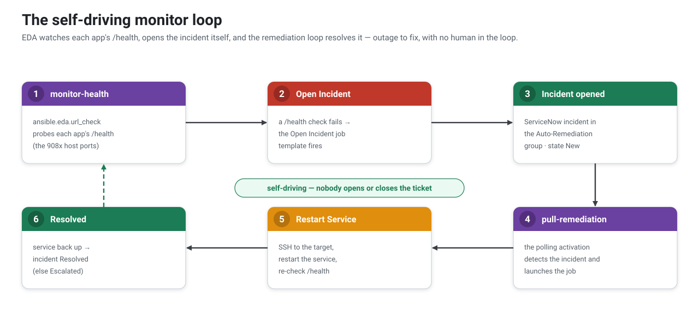

[↑ Docs map](../README.md#start-here) · [← 05 · Identity](05-identity.md) · **06 · Playbooks** · [07 · Build →](07-build.md)

# Playbooks — the automation content

The content the **Automation Controller** pulls from this repo and runs (in an execution environment)
against the **Meridian Fleet** inventory. Each playbook is launched by a **job template** that
Event-Driven Ansible triggers — pull (ServiceNow incident) or push (approved change / catalog request).

## Conventions

- **Role-aware:** playbooks act on the host's `service` inventory variable (`hr-portal`, `crm`, `ged`,
  `httpd`, `postgresql`, `postfix`) rather than a hard-coded service, so one playbook covers every
  server. Host vars come from the CMDB (see [03 · Architecture](03-architecture.md)).
- **ServiceNow:** the controller's `ServiceNow PDI` credential injects `SN_HOST` / `SN_USERNAME` /
  `SN_PASSWORD`; the `servicenow.itsm` collection reads them.
- **Target:** `target_host` (an inventory host) and the record id come from the rulebook as extra vars.

## Self-driving pull loop (monitoring)

By default the pull pattern is triggered by an incident someone (or a test) opens. The
`monitor-health` activation makes it self-driving: the rulebook
`extensions/eda/rulebooks/monitor_health_open_incident.yml` runs `ansible.eda.url_check` against each
app's `/health` and, on a failure, launches the **Open Incident** job template
([`open_incident.yml`](../playbooks/open_incident.yml)). That incident lands in the Auto-Remediation
group and the `pull-incident-remediation` activation remediates it — no human in the loop:

Validate with `python3 tests/scenarios/3_monitor_selfheal.py` (it only injects the fault — the monitor
opens the ticket).

## Catalogue

Priority: **P0** = built (core); **P1–P4** = built, from most useful to nice-to-have.

| Playbook | Does | Pattern / trigger | Targets | Status |
|---|---|---|---|---|
| `open_incident.yml` | open an Auto-Remediation incident for a down server (deduplicated) | **monitor** — url_check | all | **✅** |
| `restart_service.yml` | restart the host's `service`, clear the FastAPI "degraded" flag, re-check, resolve/escalate the incident | **pull** — incident | all | **P0 ✅** |
| `execute_change.yml` | record a change marker, restart the `service`, verify, annotate the change | **push** — approved change | all | **P0 ✅** |
| `collect_diagnostics.yml` | service status + disk + memory + recent logs → incident work note (read-only) | pull — incident | all | **P1 ✅** |
| `free_disk.yml` | vacuum journal, drop rotated logs, clear dnf cache; re-check + resolve/escalate | pull — "disk full" incident | all | **P1 ✅** |
| `db_create_role.yml` | create/reconcile a PostgreSQL login role (+ optional CONNECT grant) | push — change/catalog | db | **P2 ✅** |
| `db_apply_migration.yml` | apply a tracked `.sql` migration to a database, exactly once | push — change | db | **P2 ✅** |
| `db_status.yml` | version, uptime, connections, database sizes → work note | pull / on-demand | db | **P2 ✅** |
| `db_backup.yml` | `pg_dump -Fc` a database to an archive + prune old ones | scheduled / on-demand | db | **P2 ✅** |
| `patch_os.yml` | `dnf update`; flag (or, with `allow_reboot`, perform) a reboot | change / scheduled | all | **P3 ✅** |
| `housekeeping.yml` | force logrotate, vacuum journal, prune old DB dumps + `/var/tmp` | scheduled | all | **P3 ✅** |
| `restart_service_selfservice.yml` | restart a chosen server's service from a catalog request, then close the request item | pull — catalog | all | **P4 ✅** |
| `provision_employee.yml` | onboard a new joiner: create their **Keycloak identity** (+ Employees group), then close the request | pull — catalog | — | **P4 ✅** |

> The DB playbooks (P2) are unlocked by the real PostgreSQL on the `*-db` servers (PGDG). They connect
> as the `postgres` superuser through **peer auth** (`psql`/`pg_dump` run as the `postgres` OS user via
> `runuser`, over the local socket) — so no password and no `psycopg2` in the execution environment.
> SQL migrations live in `playbooks/files/migrations/`, tracked per-database in
> `meridian_schema_migrations`. Smoke-test the lifecycle against `hr-db-01` with
> `python3 tests/scenarios/7_db_admin_lifecycle.py`.
>
> The `hr` database holds HR **business data** — `001_leave_requests.sql` provisions a `leave_requests`
> table + a read-only `hr_app` role that the **HR Portal reads live** (employee *identity* lives in
> Keycloak, not here).

---
[↑ Docs map](../README.md#start-here) · [← 05 · Identity](05-identity.md) · **06 · Playbooks** · [07 · Build →](07-build.md)
